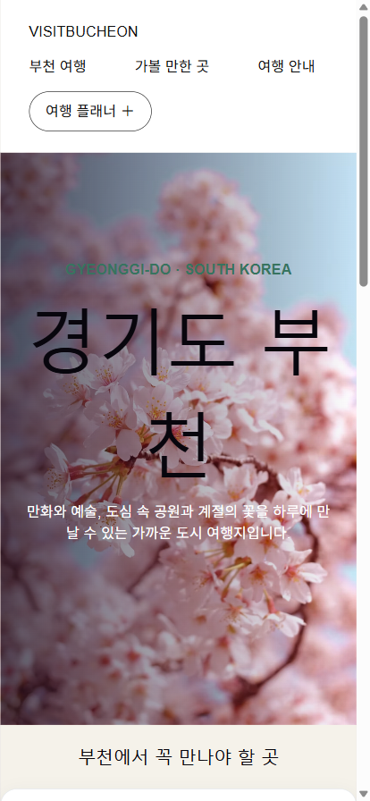

# VISIT BUCHEON 🌸

경기도 부천 여행 정보를 소개하는 React 기반 싱글 페이지 웹사이트입니다.

## 소개

만화와 예술, 도심 속 공원과 계절의 꽃을 하루에 만날 수 있는 부천의 여행 명소와
방문 정보를 안내합니다.

## 스크린샷

<table>
  <tr>
    <td></td>
    <td></td>
  </tr>
  <tr>
    <td align="center">데스크톱</td>
    <td align="center">모바일</td>
  </tr>
</table>

## 주요 기능

- **대표 명소 소개** — 원미산 진달래동산, 한국만화박물관, 상동호수공원 등 부천의
  주요 관광지를 카드로 소개하고, 각 명소를 "일정에 담기" 토글로 선택할 수 있습니다.
- **오늘의 추천** — 비동기로 불러오는 오늘의 추천 장소 카드
- **실시간 시계 & 방문 정보** — 운영시간, 입장료와 함께 현재 시각을 실시간으로 표시
- **여행 인원 카운터** — 버튼 클릭으로 여행 인원 수를 조절
- **여행 Tip** — 접기/펼치기 가능한 여행 팁 박스
- **나의 여행 메모** — 입력한 메모가 브라우저 탭 제목에 실시간으로 반영
- **여행 이야기 게시판** — 로그인 없이 누구나 글을 남기는 게시판 (Supabase). 작성자는 "느긋한 산책자 27" 같은 랜덤 닉네임으로 자동 지정
- **스크롤 애니메이션** — 스크롤에 따라 히어로가 줄어들고 섹션이 떠오르는 효과 (CSS 스크롤 타임라인, 동작 줄이기 설정 시 비활성)
- **반응형 레이아웃** — 데스크톱과 모바일(≤700px) 모두 대응하는 반응형 헤더/레이아웃

## 기술 스택

- [React 19](https://react.dev/) (React Compiler 적용)
- [Vite](https://vite.dev/)
- [Supabase](https://supabase.com/) (게시판 DB)
- ESLint

## 시작하기

```bash
# 의존성 설치
npm install

# 환경변수 설정 (.env.local) — Supabase 대시보드의 Project URL / Publishable key
echo VITE_SUPABASE_URL=https://<project-ref>.supabase.co > .env.local
echo VITE_SUPABASE_PUBLISHABLE_KEY=sb_publishable_... >> .env.local

# DB 테이블 생성: supabase/migrations/ 의 SQL을 Supabase SQL Editor에서 실행

# 개발 서버 실행 (http://localhost:5173)
npm run dev

# 프로덕션 빌드
npm run build

# 빌드 결과 미리보기
npm run preview

# 린트 검사
npm run lint
```

## 프로젝트 구조

```
src/
├── App.jsx           # 메인 페이지 컴포넌트 (헤더, 소개, 명소, 방문 정보, 안내 등)
├── Board.jsx         # 여행 이야기 게시판
├── supabaseClient.js # Supabase 클라이언트
├── App.css           # 페이지 스타일
├── index.css         # 전역 스타일
├── main.jsx          # 엔트리 포인트
└── assets/           # 이미지 리소스
```
